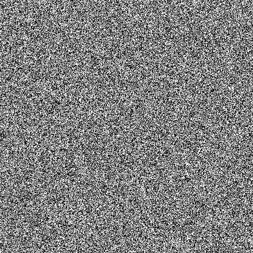

# CUDA Ising Spin Dynamics

<div align="center">
  
</div>

CUDA Ising Spin Dynamics is my project developed for the _"Modern Computing for Physics"_ course in the Physics of Data MS. This repository provides two implementations of a 2D Ising model simulation:

- **CPU Version:** A baseline single-core implementation.
- **GPU Version:** An optimized version leveraging CUDA, specifically tested on the Nvidia Jetson Nano Developer Kit (2GB).

## Table of Contents

- [About](#about)
- [Requirements](#requirements)
- [Build Script](#build-script)
- [Usage](#usage)

## About

The 2D Ising model is a classic model in statistical physics used to describe phase transitions in ferromagnetic materials. This project implements the Ising spin model simulation on a squared lattice to compare the performance of CPU-based and GPU-accelerated implementations using CUDA.

## Requirements

### Hardware
- Nvidia GPU

### Software
- **CUDA Toolkit** (required for building and running the GPU version)
- **C/C++ Compiler:**
  - GCC (for the CPU version)
  - NVCC (for compiling CUDA code in the GPU version)

## Build Script

Below is a sample bash script to compile both the CPU and GPU versions of the simulation. Save the script as `build.sh` at the repository's root and execute it from the terminal:

```bash
#!/bin/bash

echo "Building CPU version..."
cd IsingCPU
make || { echo "Error building CPU version"; exit 1; }
cd ..

echo "Building GPU version..."
cd IsingGPU
nvcc -o ising_gpu ising_gpu.cu -O2 || { echo "Error building GPU version"; exit 1; }
cd ..

echo "Build completed successfully."

